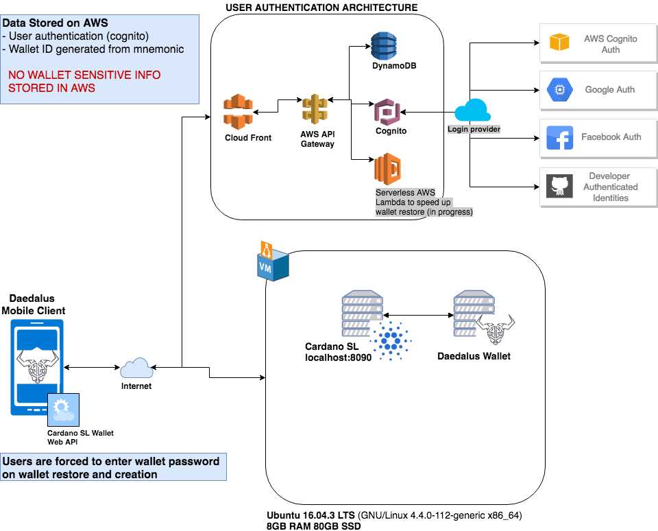
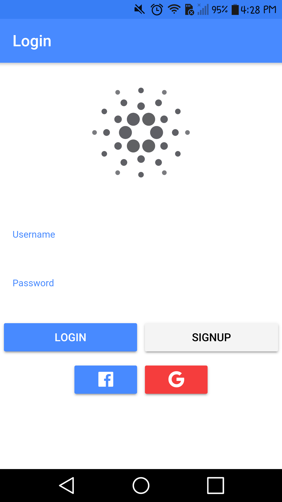

# Daedalus Mobile Client Application

This is purely a front end application layer of Daedalus wallet built with Ionic Hybrid mobile application in TypeScript. It is still in development.


## Important!
**There is no user wallet sensitive data stored by the application at any given time.** This project is a hybrid mobile applications using Ionic framework that makes use of the [Cardano SL Wallet Web API](https://cardanodocs.com/technical/wallet/api/). There are multiple components that conenct together to make this application work which are listed in detail in a later section of this document. 


## Table of Contents
 - [Getting Started](#getting-started)
 - [Overall Design/Architecture](#overall-design-architecture)
 - [Use Cases](#use-cases)
 - [App Preview](#app-preview)
 - [File Structure of App](#file-structure-of-app)


## Getting Started

* [Download the installer](https://nodejs.org/) for Node.js 6 or greater.
* Install the ionic CLI globally: `npm install -g ionic`
* Clone this repository: `https://github.com/tanzeelrana/adaWalletApp.git`.
* Run `npm install` from the project root.
* Run `ionic serve` in a terminal from the project root.

_Note: You may need to add “sudo” in front of any global commands to install the utilities._

## Overall Design Architecture
To make the full application work there are multiple components that need to be put into place before it can run properly.

* Daedalus Mobile Client App (Ionic Hybrid App in AngularJS & TypeScript)
* AWS Mobile hub using cognito authentication services [Authentication Flows](#authentication-flow)
* [Cardano SL Node](https://github.com/input-output-hk/cardano-sl)
* [Daedalus Wallet](https://github.com/input-output-hk/daedalus)



### Authentication Flow
Amazon Cognito helps you create unique identifiers for your end users that are kept consistent across devices and platforms. Amazon Cognito also delivers temporary, limited-privilege credentials to your application to access AWS resources. This page covers the basics of how authentication in Amazon Cognito works and explains the life cycle of an identity inside your identity pool.

#### Enhanced (Simplified) Authflow


## Use Cases

* ADA Tx Fee - [ [code](https://github.com/tanzeelrana/adaWalletApp/blob/master/src/providers/ada/api/adaTxFee.ts) ]
* Change Ada Wallet Passphrase - [ [code](https://github.com/tanzeelrana/adaWalletApp/blob/master/src/providers/ada/api/changeAdaWalletPassphrase.ts)]
* Delete Ada Wallet - [ [code](https://github.com/tanzeelrana/adaWalletApp/blob/master/src/providers/ada/api/deleteAdaWallet.ts	)]
* Export Ada Backup JSON - [ [code](https://github.com/tanzeelrana/adaWalletApp/blob/master/src/providers/ada/api/exportAdaBackupJSON.ts	)]
* Get Ada History By Wallet - [ [code](https://github.com/tanzeelrana/adaWalletApp/blob/master/src/providers/ada/api/getAdaHistoryByWallet.ts	)]
* Get Ada Local Time Difference - [ [code](https://github.com/tanzeelrana/adaWalletApp/blob/master/src/providers/ada/api/getAdaLocalTimeDifference.ts	)]
* Get Ada Sync Progress - [ [code](https://github.com/tanzeelrana/adaWalletApp/blob/master/src/providers/ada/api/getAdaSyncProgress.ts	)]
* Get Ada Wallet Accounts - [ [code](https://github.com/tanzeelrana/adaWalletApp/blob/master/src/providers/ada/api/getAdaWalletAccounts.ts	)]
* Import Ada Backup JSON - [ [code](https://github.com/tanzeelrana/adaWalletApp/blob/master/src/providers/ada/api/importAdaBackupJSON.ts	)]
* Import Ada Wallet - [ [code](https://github.com/tanzeelrana/adaWalletApp/blob/master/src/providers/ada/api/importAdaWallet.ts	)]
* Is Valid Ada Address - [ [code](https://github.com/tanzeelrana/adaWalletApp/blob/master/src/providers/ada/api/isValidAdaAddress.ts	)]
* New Ada Payment - [ [code](https://github.com/tanzeelrana/adaWalletApp/blob/master/src/providers/ada/api/newAdaPayment.ts	)]
* New Ada Wallet - [ [code](https://github.com/tanzeelrana/adaWalletApp/blob/master/src/providers/ada/api/newAdaWallet.ts	)]
* New Ada Wallet Address - [ [code](https://github.com/tanzeelrana/adaWalletApp/blob/master/src/providers/ada/api/newAdaWalletAddress.ts	)]
* Redeem Ada - [ [code](https://github.com/tanzeelrana/adaWalletApp/blob/master/src/providers/ada/api/redeemAda.ts	)]
* Redeem Ada Paper Vend - [ [code](https://github.com/tanzeelrana/adaWalletApp/blob/master/src/providers/ada/api/redeemAdaPaperVend.ts	)]
* Restore Ada Wallet - [ [code](https://github.com/tanzeelrana/adaWalletApp/blob/master/src/providers/ada/api/restoreAdaWallet.ts	)]
* Update Ada Wallet - [ [code](https://github.com/tanzeelrana/adaWalletApp/blob/master/src/providers/ada/api/updateAdaWallet.ts	)]

## App Preview

All app preview screenshots were taken by running `ionic serve --lab` on a retina display.

- [Login Page](https://github.com/tanzeelrana/adaWalletApp/blob/master/src/pages/login/login.html)

  


- To see more images of the app, check out the [screenshots directory](https://github.com/tanzeelrana/adaWalletApp/tree/master/resources/screenshots)!


## Deploying

* PWA - Un-comment this code to enable service worker, run `npm run ionic:build --prod` and then push the `www` folder to your favorite hosting service
* Android - Run `ionic cordova run android --prod`
  - If you are deploying to Android 4.4 or below we recommend adding crosswalk: `cordova plugin add cordova-plugin-crosswalk-webview`
* iOS - Run `ionic cordova run ios --prod`

## File Structure of App

```
ionic-conference-app/
├-- .github/                            * GitHub files
│   ├── CONTRIBUTING.md                 * Documentation on contributing to this repo
│   └── ISSUE_TEMPLATE.md               * Template used to populate issues in this repo
|
|-- resources/
|
|-- src/
|    |-- app/
|    |    ├── app.component.ts
|    |    └── app.module.ts
|    |    └── app.template.html
|    |    └── main.ts
|    |
|    |-- assets/
|    |    ├── data/
|    |    |    └── data.json
|    |    |
|    |    ├── fonts/
|    |    |     ├── ionicons.eot
|    |    |     └── ionicons.svg
|    |    |     └── ionicons.ttf
|    |    |     └── ionicons.woff
|    |    |     └── ionicons.woff2
|    |    |
|    |    ├── img/
|    |
|    |-- pages/                          * Contains all of our pages
│    │    ├── about/                     * About tab page
│    │    │    ├── about.html            * AboutPage template
│    │    │    └── about.ts              * AboutPage code
│    │    │    └── about.scss            * AboutPage stylesheet
│    │    │
│    │    ├── account/                   * Account page
│    │    │    ├── account.html          * AccountPage template
│    │    │    └── account.ts            * AccountPage code
│    │    │    └── account.scss          * AccountPage stylesheet
│    │    │
│    │    │── login/                     * Login page
│    │    │    ├── login.html            * LoginPage template
│    │    │    └── login.ts              * LoginPage code
│    │    │    └── login.scss            * LoginPage stylesheet
│    │    │
│    │    │── signup/                    * Signup page
│    │    │    ├── signup.html           * SignupPage template
│    │    │    └── signup.ts             * SignupPage code
│    │    │
│    │    │── support/                   * Support page
│    │    │    ├── support.html          * SupportPage template
│    │    │    └── support.ts            * SupportPage code
│    │    │    └── support.scss          * SupportPage stylesheet
│    │    │
│    │    │── ada/                      * ADA Tabs page
│    │    │    ├── ada.html             * ADA TabsPage template
│    │    │    └── ada.ts               * ADA TabsPage code
│    │    │
│    │    └── tutorial/                  * Tutorial Intro page
│    │         ├── tutorial.html         * TutorialPage template
│    │         └── tutorial.ts           * TutorialPage code
│    │         └── tutorial.scss         * TutorialPage stylesheet
|    |
│    ├── providers/                      * Contains all Injectables
│    │     ├── conference-data.ts        * ConferenceData code
│    │     └── user-data.ts              * UserData code
│    │     └── ada/                      * ADA Provider code
│    ├── theme/                          * App theme files
|    |     ├── variables.scss            * App Shared Sass Variables
|    |
|    |-- index.html
|
|-- www/
|    ├── assets/
|    |    ├── data/
|    |    |    └── data.json
|    |    |
|    |    ├── fonts/
|    |    |     ├── ionicons.eot
|    |    |     └── ionicons.svg
|    |    |     └── ionicons.ttf
|    |    |     └── ionicons.woff
|    |    |     └── ionicons.woff2
|    |    |
|    |    ├── img/
|    |
|    └── build/
|    └── index.html
|
├── .editorconfig                       * Defines coding styles between editors
├── .gitignore                          * Example git ignore file
├── LICENSE                             * Apache License
├── README.md                           * This file
├── config.xml                          * Cordova configuration file
├── ionic.config.json                   * Ionic configuration file
├── package.json                        * Defines our JavaScript dependencies
├── tsconfig.json                       * Defines the root files and the compiler options
├── tslint.json                         * Defines the rules for the TypeScript linter
```
